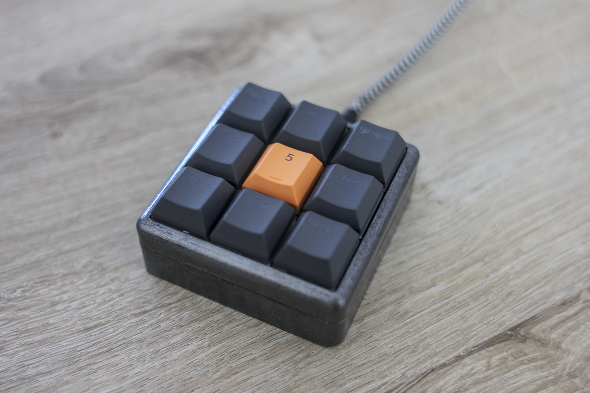
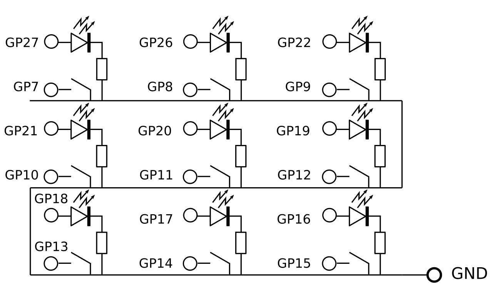
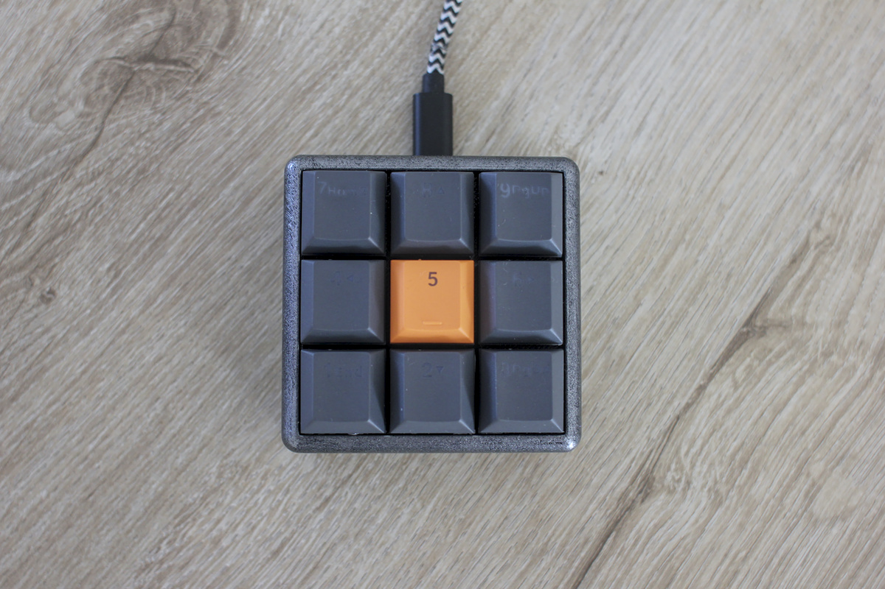

# MacroPad
All code and files for setting up a Raspberry Pi Pico powered macropad.





## Building the MacroPad

Here is an overview of all items you'll need to build a MacroPad just like the one above. More detailed instructions can be found the blog [here](http://blog.4dcu.be/diy/2021/04/05/Macropad.html)

*  1x a MacroPad case (3D printed from STL files)
*  1x a Raspberry Pi Pico
*  9x Mechanical keyboard switches (Gateron, Cherry MX, Kailh… should all fit)
*  a set of keycaps (e.g. for numpad keys)
*  9x 1.8 mm 2V LEDs (current 15-20 mA) (optional)
*  9x 82 Ohm resistors (optional)
*  1x a switch opener (optional)
*  4x M3 bolts (1 cm long)
*  some heat-shrink tubing
*  wire, single core and flexible
*  soldering equipment
*  a third hand tool
*  a hot-glue gun
*  a USB-micro cable

You'll have to wire everything as shown in the schematic below:



## Preparing the Raspberry Pi Pico

You'll need to install CircuitPython and the [ADAFruit HID](https://github.com/adafruit/Adafruit_CircuitPython_HID) library. 

## Installing the code

Simply copy the code from the ```./code``` folder to the root folder of the Pi Pico. In case you wish to change the button map, have a look at ```code.py```.

